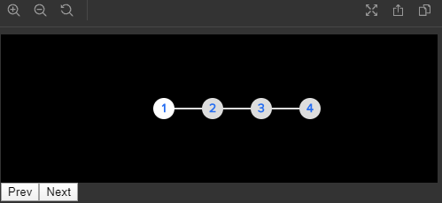
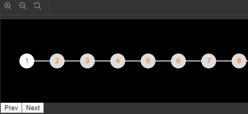

This project was bootstrapped with [Create React App](https://github.com/facebook/create-react-app).

## Overview
This project is about a step-by-step progress bar where you can set the amount of steps. 

It also contains a short animation after moving through steps and during the load of the active one.

## Available Scripts

In the project directory, you can run:

### `npm run storybook`

This command run the storybook toolset which shows two different themes for the component.

## Theme 1:

## Theme 2:

